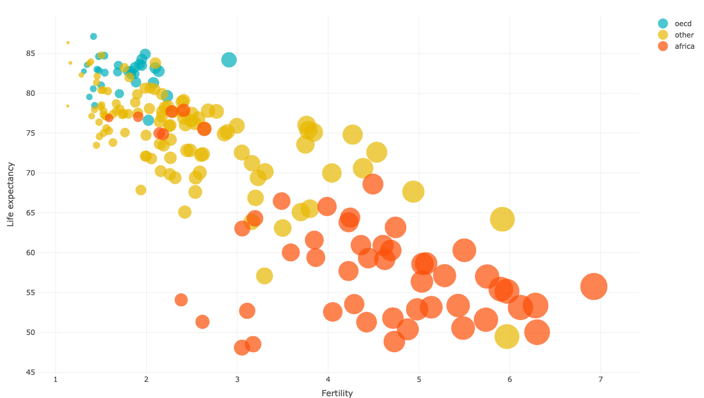
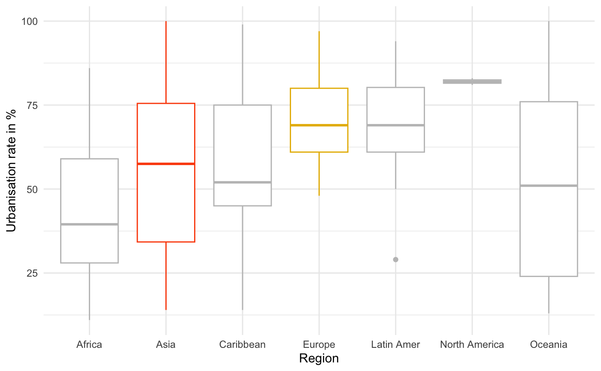

# UN data
## R Markdown
### Project Overview
This analysis project aims to provide insight into the differences in life expectancy, fertility rate and urbanisation in the country groups and regions in the given data set through hypothesis testing.

**H1**: There are significant differences between Africa and other country groups in terms of life expectancy and fertility rate.

**H2**: Life expectancy of women in African countries is significantly lower than in other country groups and in OECD countries. 

**H3**: There are significant differences between the regions Asia and Europe in terms of the urbanisation rates.

The hypotheses may not be very intriguing and predictable in advance, however, the main purpose of this analysis was to learn about hypothesis testing, in particular one-way ANOVA.

### Data Sources
The data set provides information on national health, welfare and population statistics for 213 locations, mainly UN members.
The data can be accessed within the _car_ package using the following code.
```
library(car)
data(UN)
```

### Tools
- R markdown

### Access markdown html
[Click here](https://ckeuss.github.io/UN_R_dataset/)

### Data Analysis
Some interesting code worked with:

```
mean_overview_group <- UN_data %>%
  select(group, fertility, ppgdp, lifeExpF, pctUrban, infantMortality) %>%
  group_by(group) %>%
  mutate(N = n()) %>%  
  summarise_all(mean)
```
```
ggplot(UN_data, aes(x = group, y = lifeExpF, color = group)) +
  geom_boxplot() +
  labs(
    x = "Group",
    y = "Life Expectancy of women (years)"
  )+
   scale_color_manual(values = c("#00AFBB", "#E7B800", "#FC4E07"))+
  theme_minimal()+
  guides(color = FALSE)
```
```
subset_data <- subset(UN_data, region %in% c("Africa", "Asia"))
cohen.d(pctUrban ~ region, data = subset_data)
```

### Insights on life expectancy, fertility rate and urbanisation rate
The Kruskal-Wallis-Test and the pairwise comparisons indicate significant differences between African countries and OECD countries and others in terms of fertility rate and life expectancy. The life expectancy of women in African countries tends to be significantly lower than in the OECD and other countries and the fertility rate significantly higher.  



From the analysis of the urbanisation rate in Aisa and Europe using an ANOVA test it can be concluded that the urbanisation rate tends to be higher in Europe, however the differences seem the be moderate (medium effect size).  



